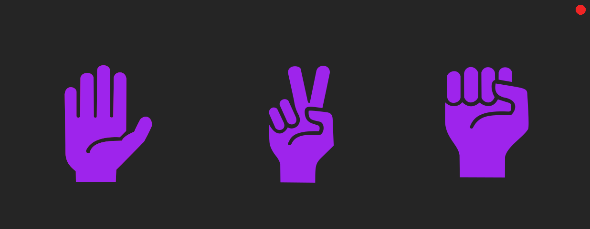
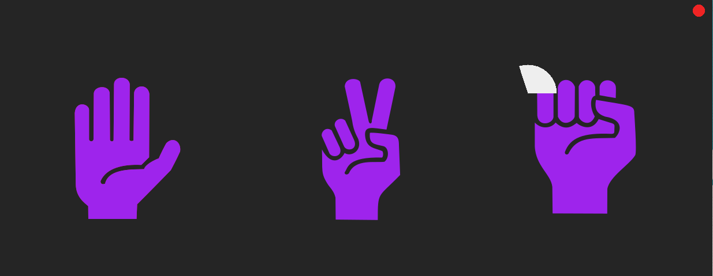

# Gesturify

<p align="center">
  
  
  
</div>


## About
Desktop aplication to execute pre-defined scripts based on gesture recognition

## Images




## ⛏️ Built Using <a name = "built_using"></a>

- [Python](https://www.python.org/)
- [OpenCV](https://opencv.org/) 
- [MediaPIPE](https://developers.google.com/mediapipe)

## ✍️ Authors <a name = "authors"></a>

- [@LucasPeixotg](https://github.com/lucaspeixotg) - Idea & Initial work


<!--
## 📝 Table of Contents

- [About](#about)
- [Getting Started](#getting_started)
- [Deployment](#deployment)
- [Usage](#usage)
- [Built Using](#built_using)
- [TODO](../TODO.md)
- [Contributing](../CONTRIBUTING.md)
- [Authors](#authors)
- [Acknowledgments](#acknowledgement)

## 🧐 About <a name = "about"></a>

Write about 1-2 paragraphs describing the purpose of your project.

## 🏁 Getting Started <a name = "getting_started"></a>

These instructions will get you a copy of the project up and running on your local machine for development and testing purposes. See [deployment](#deployment) for notes on how to deploy the project on a live system.

### Prerequisites

What things you need to install the software and how to install them.

```
Give examples
```

### Installing

A step by step series of examples that tell you how to get a development env running.

Say what the step will be

```
Give the example
```

And repeat

```
until finished
```

End with an example of getting some data out of the system or using it for a little demo.

## 🔧 Running the tests <a name = "tests"></a>

Explain how to run the automated tests for this system.

### Break down into end to end tests

Explain what these tests test and why

```
Give an example
```

### And coding style tests

Explain what these tests test and why

```
Give an example
```
-->


